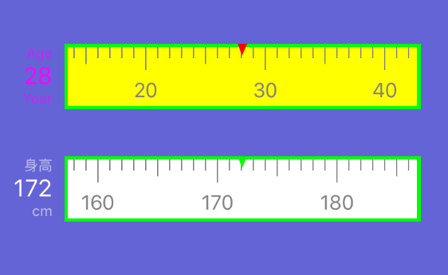
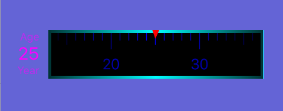

<h2>Table of Contents</h2>

<ul>
<li><a href="#org00869fb">1. AYPickerDataView</a>
<ul>
<li><a href="#org2d23d2d">1.1. A pickerView library for iOS 滚动选择条</a></li>
<li><a href="#orga6b8356">1.2. Screenshots</a></li>
<li><a href="#orgdb8987c">1.3. How to use</a></li>
<li><a href="#org443837e">1.4. 如何使用</a></li>
<li><a href="#orged0a023">1.5. 更新</a></li>
<li><a href="#org6cf3513">1.6. happy hacking, enjoy!</a></li>
</ul>
</li>
</ul>

# AYPickerDataView

## A pickerView library for iOS 滚动选择条

## Screenshots

---

&nbsp;

## How to use

## 如何使用

    #import "AYPickerDataView.h"
    
    
       HLPickerCellView *cellView = [HLPickerCellView viewWithFrame:frame Name:@"Age" unit:@"Year" valueRangeFromMin:@0 toMax:@100 defaultValue:@25 andOwner:self   type:HLPersonCellViewEnumAge];
    
     cellView.scaleBackgroundColor = [UIColor yellowColor];
       cellView.scaleColor = [UIColor blueColor];
       cellView.scaleBorderWidth = 3.0;
       cellView.scaleCursorColor = [UIColor redColor];
       cellView.resultTextColor = [UIColor magentaColor];
    
       // add a gradient effect for the ruler
       cellView.gradientEnable = YES;
       cellView.gradientColorCenter = [UIColor colorWithWhite:0 alpha:0];
       cellView.gradientColorCorner = [UIColor colorWithWhite:0 alpha:0.8];

## 更新

添加一个渐变layer， 使滚动栏具有立体感。

## happy hacking, enjoy!

